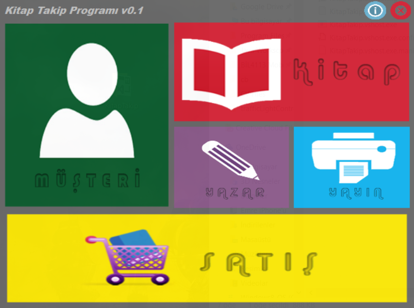
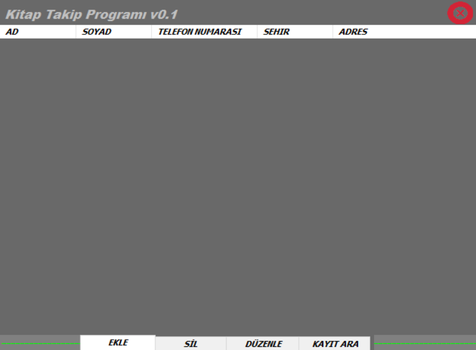

# Bookstore Automation

2015 yılında tasarlanmıştır. Kitap satış dükkanları için kitap stok takibinin otomasyonla kontrolü için tasarlanmıştır. Deneysel olarak tasarımında win8 teması kullanılmıştır. Veritabanı erişimi Microsoft Access üzerinden sağlanmaktadır.

- **Windows 8 teması**
> Uygulama içerisinde kullanıcı ve kitap sekmeleri aktiftir. Diğer sekmeler işlevsel olarak benzerlik taşımaktadır. Geliştirmeye açıktır.

- **Altta oluşan menü bar sayesinde veri üzerinde istenilen değişiklikler veya filtrelemeler yapılabilir.

